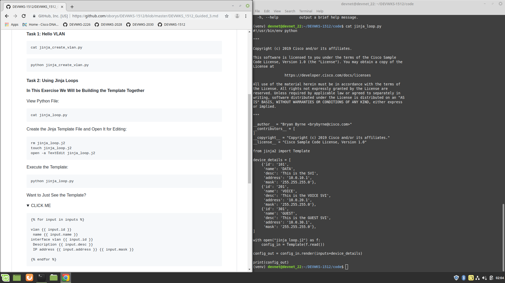

# Welcome to Cisco Live Barcelona!

Becoming the Jinja Ninja: Using YAML and Jinja Tamplates to Create Reusable Code

Join the Webex Teams space
```
http://cs.co/eventsbot#DEVWKS-1512
```

When you see a box that looks like this:

```
Interesting text here
```
You will copy this text and paste it into the terminal. For those that aren't familiar with Linux here is a brief cheat sheet:

### Copy - CTRL+INSERT
### Paste - SHIFT+INSERT

Clone the repo
```
git clone https://github.com/oborys/DEVWKS-1512.git
```

Work with python

```
cd DEVWKS-1512/code
python3 -m venv venv
source venv/bin/activate
pip install -r requirements.txt 
```



Let's get started with the lab: 

## [Click Here!](DEVWKS_1512_Guided_2.md)

